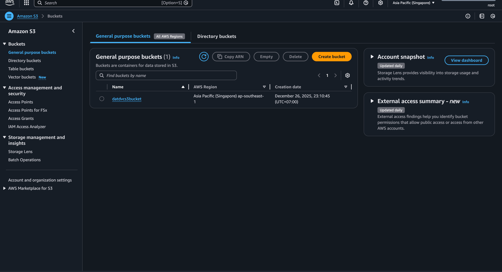
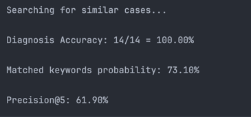

# Clinical Diagnosis RAG System

An AI-powered Retrieval-Augmented Generation (RAG) system for clinical diagnosis of tropical and infectious diseases. The system processes medical case reports, creates searchable embeddings, and generates evidence-based diagnostic recommendations.

## Key Features

- **End-to-end RAG pipeline** for medical diagnosis
- **PDF extraction** with text and image processing
- **LLM-based filtering** using Google Gemini for structured data extraction
- **Semantic search** with FAISS vector store
- **Streamlit web interface** for interactive diagnosis
- **Comprehensive evaluation** framework with metrics
- **Data versioning** with DVC and AWS S3 storage

## Performance Metrics

Evaluated on 14 tropical disease test cases:
- **Diagnosis Accuracy:** 100% (14/14 correct)
- **Keyword Match:** 73.10%
- **Precision@5:** 61.90%

## Tech Stack

| Component | Technology                               |
|-----------|------------------------------------------|
| **LLM** | Google Gemini (Gemma)                    |
| **Embeddings** | Sentence Transformers (all-MiniLM-L6-v2) |
| **Vector Store** | FAISS                                    |
| **Framework** | LangChain                                |
| **Data Versioning** | DVC + AWS S3                             |
| **Web Interface** | Streamlit                                |
| **Evaluation** | Custom metrics framework                 |

## Project Structure
```text
clinical-diagnosis-rag/
├── app.py                      # Streamlit web interface
├── main.py                     # Pipeline entry point
├── requirements.txt            # Python dependencies
├── .dvc/                       # DVC configuration
├── dvc.yaml                    # DVC pipeline definition (optional)
├── config/
│   └── settings.py            # Configuration & API keys
├── data/                       # Data directories (tracked by DVC)
│   ├── raw/
│   │   └── case_reports/      # Original PDF files
│   ├── processed/
│   │   ├── extracted/         # Extracted text & images
│   │   └── filtered/          # LLM-filtered clinical data
│   └── vector_store/
│       └── clinical_faiss/    # FAISS vector index
├── src/
│   ├── extraction/
│   │   └── pdf_extractor.py  # PDF processing
│   ├── filtering/
│   │   ├── gemini_client.py  # Gemini API integration
│   │   └── clinical_filter.py # Clinical data filtering
│   ├── embedding/
│   │   └── embedder.py        # Vector embeddings
│   ├── generation/
│   │   └── rag_generator.py   # RAG query system
│   └── indexing/              # Index utilities
└── tests/
    ├── evaluate_rag.py        # Evaluation framework
    └── ground_truth.py        # Test dataset
```

## Getting Started

### Prerequisites

- Python 3.11+
- AWS account (for S3 storage with DVC)
- Google Cloud API key (for Gemini)

### 1. Clone Repository
```bash
git clone https://github.com/YOUR_USERNAME/clinical-diagnosis-rag.git
cd clinical-diagnosis-rag
```

### 2. Set Up Environment
```bash
# Create virtual environment
python3.11 -m venv .venv
source .venv/bin/activate  # macOS/Linux
# .venv\Scripts\activate   # Windows

# Install dependencies
pip install -r requirements.txt
```

### 3. Configure Credentials

Create `.env` file (never commit this!):
```bash
# .env
GOOGLE_API_KEY=your-gemini-api-key
AWS_ACCESS_KEY_ID=your-aws-key
AWS_SECRET_ACCESS_KEY=your-aws-secret
```

Update `config/settings.py` with your paths.

### 4. Pull Data from DVC (S3)
```bash
# Configure AWS credentials
aws configure

# Pull data from S3
dvc pull
```



This downloads:
- 100+ processed clinical case reports
- Pre-built FAISS vector index
- Evaluation datasets

### 5. Run the Application

#### Option A: Streamlit Web Interface
```bash
streamlit run app.py
```

Navigate to `http://localhost:8501` and enter patient symptoms.

#### Option B: Command Line
```bash
python main.py --stage query --question "Patient with fever and malaria symptoms..."
```

## Evaluation

Run comprehensive evaluation:
```bash
python tests/evaluate_rag.py
```

**Output:**


```
Diagnosis Accuracy: 14/14 = 100%
Keyword Match: 73.10%
Precision@5: 61.90%
```

## Data Versioning with DVC

### Why DVC + AWS S3?

- **Version control for data** (100+ PDFs, embeddings, indexes)
- **Efficient storage** (data in S3, not Git)
- **Reproducible pipelines**
- **Team collaboration** without repository bloat

### DVC Commands
```bash
# Pull data from S3
dvc pull

# Track new data
dvc add data/raw/case_reports
git add data/raw/case_reports.dvc .gitignore
git commit -m "Track new case reports"

# Push data to S3
dvc push

# Check status
dvc status
```

### DVC Remote Configuration
```bash
# View remote
dvc remote list
# Output: storage  s3://your-bucket/clinical-rag

# Modify remote
dvc remote modify storage url s3://new-bucket/path
```

## Development Workflow

### Adding New Features

1. **Extract data:**
```bash
   python src/extraction/pdf_extractor.py
```

2. **Filter with Gemini:**
```bash
   python src/filtering/gemini_client.py
```

3. **Create embeddings:**
```bash
   python src/embedding/embedder.py
```

4. **Update vector store:**
```bash
   # Store is automatically saved to data/vector_store/
```

5. **Track with DVC:**
```bash
   dvc add data/processed/filtered
   dvc push
   git add data/processed/filtered.dvc
   git commit -m "Update filtered data"
```

### Running Tests
```bash
# Run evaluation
python -m tests.evaluate_rag

# Test individual components
python -m pytest tests/
```

## Pipeline Stages

### Stage 1: Extraction
- Input: Raw PDF case reports
- Output: Extracted text + images
- Tool: PyMuPDF

### Stage 2: Filtering
- Input: Extracted text
- Output: Structured clinical data (JSON)
- Tool: Google Gemini LLM

### Stage 3: Embedding
- Input: Filtered clinical data
- Output: Vector embeddings
- Tool: Sentence Transformers

### Stage 4: Indexing
- Input: Embeddings
- Output: FAISS vector store
- Tool: FAISS

### Stage 5: Generation
- Input: Query + Retrieved cases
- Output: Diagnosis with evidence
- Tool: LangChain + Gemini(Gemma)

## Diseases Covered

Evaluation includes 14 tropical and infectious diseases:
- Malaria, Dengue Fever, Tuberculosis
- HIV/AIDS, Ebola, Schistosomiasis
- Meningitis, Leptospirosis, Chikungunya
- Zika, Yellow Fever, Typhoid Fever
- Visceral Leishmaniasis, Strongyloidiasis

## Security & Best Practices

- No credentials in Git - use `.env` and `.gitignore`
- DVC for large files - keep Git repository lean
- AWS IAM permissions - minimal S3 access only
- API rate limiting - handles Gemini free tier limits
- Input validation - sanitizes user inputs in Streamlit

## Roadmap

- [ ] Deploy to cloud (Google Cloud Run / AWS Lambda)
- [ ] Add differential diagnosis (top-3 predictions)
- [ ] Multi-language support
- [ ] Fine-tune embeddings on medical corpus
- [ ] User feedback loop for model improvement
- [ ] Migrate to PostgreSQL + pgvector
- [ ] Add comprehensive test suite with pytest
- [ ] Docker containerization

## Contributing

Contributions welcome! Please:
1. Fork the repository
2. Create a feature branch
3. Add tests for new features
4. Submit a pull request

## License

MIT License - see LICENSE file for details

## Acknowledgments

- Clinical case reports from medical literature
- Google Gemini API for LLM capabilities
- Sentence Transformers for embeddings
- LangChain framework for RAG implementation
- DVC for data version control

## Contact

For questions or collaboration:
- GitHub: [@Thanh Dat Le](https://github.com/lethanhdatphumy)
- LinkedIn: [Thanh Dat Le](https://www.linkedin.com/in/thanh-dat-le-a9221125b/)

---

**If you find this project useful, please star the repository!**